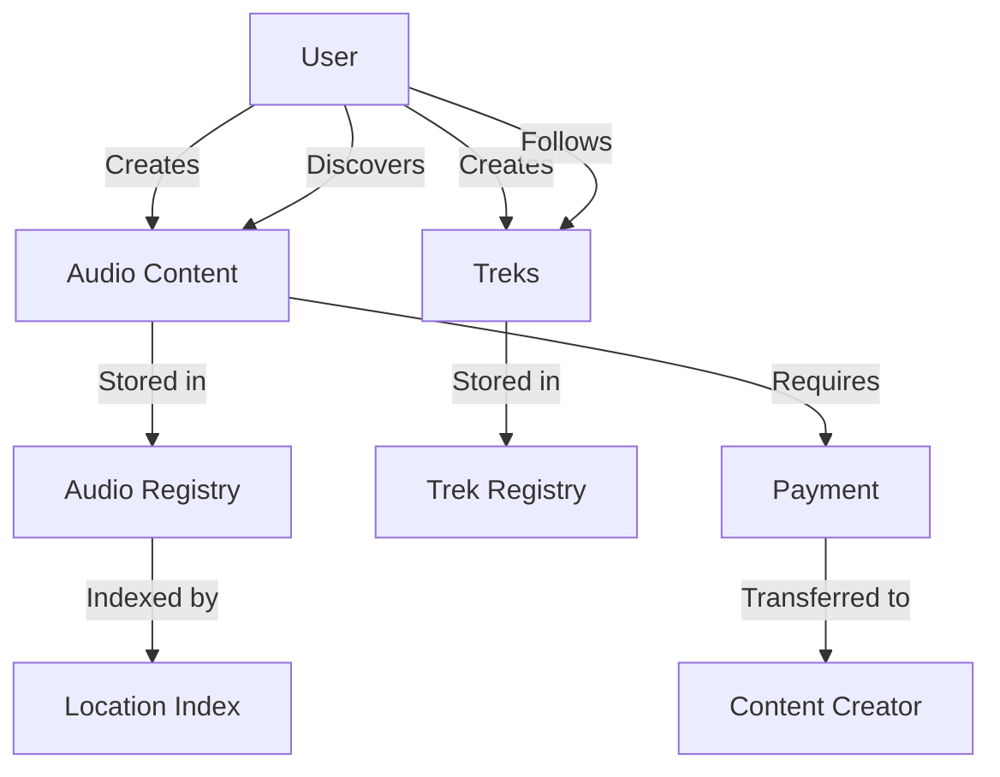

# SoundTrek Audio Diaries

A blockchain-powered platform for creating, sharing, and monetizing location-based audio experiences on the Stacks blockchain. Create and discover immersive audio content tied to specific geographic locations around the world.

## Overview

SoundTrek Audio Diaries enables users to:
- Create location-based audio content (diaries, soundscapes, tours)
- Monetize audio content through micropayments
- Discover audio experiences based on location
- Create and share curated audio paths ("treks")
- Verify location data cryptographically
- Maintain ownership and control of created content

## Architecture

The platform is built on the Stacks blockchain using Clarity smart contracts. Here's how the system works:



### Core Components:
- Audio content registry: Manages audio entries and ownership
- Location indexing: Maps geographic coordinates to content
- Trek system: Handles curated paths of audio content
- Payment processing: Manages micropayments for premium content

## Contract Documentation

### soundtrek-registry.clar

The central registry contract that manages all platform functionality.

#### Key Features:
- Audio content registration and management
- Geographic content indexing
- Trek creation and management
- Ownership tracking and transfers
- Payment processing
- Play count tracking

#### Access Control:
- Content updates restricted to owners
- Trek modifications restricted to trek owners
- Public read access for content discovery

## Getting Started

### Prerequisites
- [Clarinet](https://github.com/hirosystems/clarinet)
- Stacks wallet
- IPFS node (for content storage)

### Basic Usage

1. Register new audio content:
```clarity
(contract-call? .soundtrek-registry register-audio
    "My Audio Tour"
    "A walking tour of downtown"
    40723196
    -73989309
    "QmHash..."
    false
    u1000000
    (list "tour" "walking" "history")
)
```

2. Create a trek:
```clarity
(contract-call? .soundtrek-registry create-trek
    "Historical Downtown Trek"
    "Experience the history of downtown"
    (list u1 u2 u3)
    (list "history" "walking")
)
```

## Function Reference

### Content Management

#### register-audio
```clarity
(define-public (register-audio
    (title (string-ascii 64))
    (description (string-utf8 500))
    (lat int)
    (lng int)
    (ipfs-hash (string-ascii 64))
    (is-private bool)
    (price uint)
    (tags (list 10 (string-ascii 20)))
))
```

#### update-audio
```clarity
(define-public (update-audio
    (audio-id uint)
    (title (string-ascii 64))
    (description (string-utf8 500))
    (is-private bool)
    (price uint)
    (tags (list 10 (string-ascii 20)))
))
```

### Trek Management

#### create-trek
```clarity
(define-public (create-trek
    (title (string-ascii 64))
    (description (string-utf8 500))
    (audio-ids (list 50 uint))
    (tags (list 10 (string-ascii 20)))
))
```

### Content Discovery

#### find-audio-by-location
```clarity
(define-read-only (find-audio-by-location (lat int) (lng int)))
```

## Development

### Testing
1. Clone the repository
2. Install Clarinet
3. Run tests:
```bash
clarinet test
```

### Local Development
1. Start Clarinet console:
```bash
clarinet console
```
2. Deploy contracts:
```clarity
(contract-call? .soundtrek-registry ...)
```

## Security Considerations

### Limitations
- Maximum 10 tags per content item
- Maximum 50 audio items per trek
- Location precision limited to 6 decimal places
- Maximum 500 audio items per user
- Maximum 100 treks per user

### Best Practices
- Verify ownership before content modifications
- Handle payment failures gracefully
- Validate coordinate data
- Check list length limits
- Verify IPFS hashes
- Regular balance checks for paid content